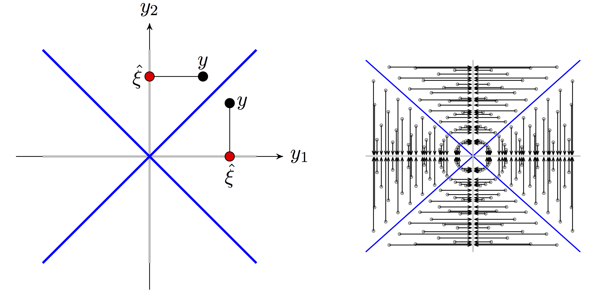

```{r init, echo=FALSE, warning=FALSE, message=FALSE}
library("ggplot2")
library("grid")
library("gridExtra")
library("glmnet")
library("leaps")
library("reshape2")
knitr::opts_chunk$set(cache = TRUE, out.width = 900, comment = NA, echo=FALSE,
                      dev.args = list(bg = 'transparent'), fig.align = "center")
theme_replace(plot.background = element_rect(fill = NA, color = NA))
```

```{r dfSmooth, echo=FALSE}
### Modified from Frederik Riis Mikkelsen's code

### df_s_diff
##  returns density based estimate of differential of df_s
##  Note: uses adaptive kernel smoother (see p. 350-351 in Givens and Hoeting)

df_s_diff <- function(lambda, DF, sigma = 1, eps = 0.005, adjust = 0.8){
  DF_inf  <- cummin(DF)  # get the inf_{lambda'<lambda}DF(lambda') 
  
  # identify the values of log(lambda), at which there was a jump in DF_inf, with respective multiplicities
  jumps   <- rep(log(lambda), c(0, -diff(DF_inf))) 
  
  # length
  n_jumps <- length(jumps)
  
  if (length(unique(jumps)) > 1){
    ## Step 1: get pilot estimator at jump points.
    dens    <- density(jumps, adjust = sigma * adjust, from = jumps[1], to = jumps[n_jumps], n = 256)
    h_pilot <- dens$bw
    f_tilde <- approx(x = dens$x, y = dens$y, xout = jumps)$y   # Interpolate to get values at jump points
    f_tilde[f_tilde < eps] <- eps                               # If below eps, replace by eps
    
    ## Step 2: calculate adaptive bandwidth (multiply pilot bandwith with geometric mean of sqrt of f_tilde)
    h_adapt <- h_pilot * exp(sum(log(f_tilde)) / (2 * n_jumps)) / sqrt(f_tilde)
    
    ## Step 3: evaluate the kernel density smoother in log(lambda)
    f_hat   <- colMeans(exp(-(outer(jumps, log(lambda), "-") / h_adapt)^2 / 2) / h_adapt) / sqrt(2 * pi)
    f_hat   <- f_hat * n_jumps                                  # It must integrate to n_jumps
  } else if (length(unique(jumps)) == 1) {
    ## If only one unique jump return a gaussian density times number of jumps
    f_hat   <- dnorm(log(lambda), mean = unique(jumps), sd = sigma) * n_jumps
  } else {
    f_hat   <- rep(0, length(lambda))
  }
  
  return(f_hat)
}

### Finding the jump lambdas: 
# provided: vector x of length n+1: (x0 > x1 > x2 ... > xn) (here rss)
# want: lambdas at which x + lambda * 0:n switches minimal value
# for lam = 0, the last entry is smallest. 
# at any given lambda, increasing lambda will only lead to some of the previous entries in x + lam * 0:n to be smallest
# the first time lambda jumps is when lambda * (0:n - n) - (xn - x) is zero (can only happen for k < n)
# let k1 denote this entry, k1 < n
# the next time lambda jumps is when lambda * (0:k1 - k1) - (xk1 - x[1:(k1-1)]) is zero (only for k < k1), and so on

find_jump <- function(x){
  if (is.unsorted(rev(x))) stop("x is not strictly decreasing")
  
  DF_s     <- numeric()
  lambda_j  <- numeric()
  
  k <- length(x) - 1
  i <- 2
  
  DF_s[1] <- k
  lambda_j[1] <- 0
  
  while (k > 0){
    # if lambda * (0:k1 - k1) - (xk1 - x[1:(k1-1)]), then lam_star is where that would happen
    lam_star <- (x[1:k] - x[k + 1]) / (k - 0:(k-1))
    
    # find new k, shift with 1 since entry 1 corresponds to DF = 0
    k <- which.min(lam_star) - 1
    
    # store
    lambda_j[i] <- lam_star[k + 1]
    DF_s[i] <- k  
    
    # update
    i <- i + 1
  }
  
  return(list(DF_s = DF_s, lambda_j = lambda_j))
}
```

```{r selectFun, echo=FALSE, dependson="dfSmooth"}
## Uses regsubsets to select best subsets. RSS for selected models 
## are returned together with (naive) degrees-of-freedom. The coefficients 
## for all selected models can optionally be returned as well in a form 
## suitable for model averaging. 
rsub <- function(x, y, ...,  coef = NULL) {
  tmp <- regsubsets(x = x, y = y, ..., intercept = FALSE)
  models <- tmp$ress < 1e35
  nr <- rowSums(models)
  df <- unlist(lapply(seq_along(nr), function(i) rep(i, nr[i])))
  if(isTRUE(coef)) {
    coef0 = coef(tmp, seq_along(df))
    labels <- tmp$xnames
    coef <- matrix(0, length(labels), length(coef0), 
                   dimnames = list(labels))
    for(i in seq_along(coef0))
      coef[names(coef0[[i]]), i] <- coef0[[i]]
  }
  list(rss = as.vector(t(tmp$ress)[t(models)]),
       rss0 = sum(y^2),
       df = df,
       coef = coef,
       p = ncol(x),
       rsub = tmp)
} 

AICselect <- function(x, c = 2, ...) {
  AIC <- x$rss + c * x$df 
  id <- which.min(AIC)
  coef <- numeric(x$p)
  if(AIC[id] < x$rss0) {
    if(is.null(x$coef)) {
      coefid <- which(summary(x$rsub)$which[id, ])
      coef[coefid] <- coef(x$rsub, id)
    } else {
      coef <- x$coef[, id]
    }
  }
  list(AIC = AIC[id], 
       id = id, 
       df = x$df[id], 
       coef = coef)
}

ICselect <- function(x, c = 2, ...) {
  IC <- c(x$rss0, x$rss)[x$index + 1] + c * x$dfhat 
  id <- x$index[which.min(IC)]
  coef <- numeric(x$p)
  if(id > 0) {
    if(is.null(x$coef)) {
      coefid <- which(summary(x$rsub)$which[id, ])
      coef[coefid] <- coef(x$rsub, id)
    } else {
      coef <- x$coef[, id]
    }
  }
  list(IC = IC[id], 
       id = id, 
       df = x$df[id],
       dfhat = x$dfhat[id], 
       coef = coef)
}

AICaverage <- function(x, c = 2, beta = 0.5, ...) {
  if(is.null(x$coef)) 
    stop("Needs coefficients for all models.")
  AIC <- x$rss + c * x$df 
  weights <- exp(- beta * AIC)
  ## The model with no predictors is included explicitly
  denom <- exp(- beta *  x$rss0) + sum(weights)
  weights <- weights / denom
  list(weights = weights,
       coefMat = x$coef, 
       df = x$df, 
       coef = x$coef %*% weights)
}

ICaverage <- function(x, c = 2, beta = 0.5, ...) {
  if(is.null(x$coef)) 
    stop("Needs coefficients for all models.")
  IC <- c(x$rss0, x$rss)[x$index + 1] + c * x$dfhat 
  weights <- exp(- beta * IC)
  ## The model with no predictors is included explicitly
  weights <- weights / sum(weights)
  list(weights = weights,
       lambda = x$lambda,
       dfhat = x$dfhat, 
       coef = cbind(0, x$coef)[, x$index + 1] %*% weights)
}

simXy <- function(n, p, beta0, B, sigma = 1) {
  ## Set alpha < 1 to introduce correlation between the X-variables
  alpha <- 1 
  X <- matrix(rnorm(n * p, sd = sqrt(alpha)), n, p) + 
    rnorm(n, sd = sqrt(1 - alpha))
  y <- rnorm(B * nrow(X), X %*% beta0, sd = sigma)
  list(X = X, 
       y = matrix(y, ncol = B))
}

selectAIC <- function(n, p, beta0, B = 1000, nbest = 1, nvmax = 5, ...) {
  if(length(beta0) < p)
    beta0 <- c(beta0, rep(0, p - length(beta0)))
  Xy <- simXy(n, p, beta0, B)
  parhat0 <- apply(Xy$y, 2, function(y) lm.fit(x = Xy$X, y = y)$coefficients)
  tmp <- apply(Xy$y, 2, function(y) rsub(x = Xy$X, y = y, nbest = nbest, nvmax = nvmax))
  parhat <- sapply(tmp, function(x) AICselect(x, ...)$coef)
  list(parhat = parhat,
       parhat0 = parhat0,
       beta0 = beta0)
}

averageAIC <- function(n, p, beta0, B = 1000, nbest = 10, nvmax = 5, ...) {
  if(length(beta0) < p)
    beta0 <- c(beta0, rep(0, p - length(beta0)))
  Xy <- simXy(n, p, beta0, B)
  parhat0 <- apply(Xy$y, 2, function(y) lm.fit(x = Xy$X, y = y)$coefficients)
  tmp <- apply(Xy$y, 2, function(y) rsub(x = Xy$X, y = y, nbest = nbest, nvmax = nvmax, coef = TRUE))
  AICav <- lapply(tmp, function(x) AICaverage(x, ...))
  parhat <- sapply(AICav, function(x) x$coef)
  ## Weights aggregated per number of variables are not that informative
  ## weights <- sapply(AICav, function(x) tapply(c(1 - sum(x$weights), x$weights), c(0, x$df), sum))
  ## Weights aggregated for individual variables are more interesting 
  ## (distribution of 'variable importance' measure).
  weights <- sapply(AICav, function(x) (x$coefMat != 0) %*% x$weights)
  row.names(weights) <- seq_len(nrow(weights))
  list(parhat = parhat,
       parhat0 = parhat0,
       beta0 = beta0,
       weights = weights)
}

riskAIC <- function(n, p, beta0, B = 1000, nvmax = 100, ...) {
  if(length(beta0) < p)
    beta0 <- c(beta0, rep(0, p - length(beta0)))
  Xy <- simXy(n, p, beta0, B)
  parhat0 <- apply(Xy$y, 2, function(y) lm.fit(x = Xy$X, y = y)$coefficients)
  tmp <- apply(Xy$y, 2, function(y) rsub(x = Xy$X, y = y, nvmax = nvmax, 
                                         coef = TRUE, method = "forward"))
  AIC <- rowMeans(sapply(tmp, function(x) x$rss + 2 * x$df)) - n
  AIC <- c(sum(Xy$y^2) / B - n, AIC)
  AICav <- lapply(tmp, function(x) AICaverage(x, ...))
  parhata <- sapply(AICav, function(x) x$coef)
  parhats <- sapply(tmp, function(x) AICselect(x, ...)$coef)
  mse <- rowMeans(sapply(tmp, function(x) colSums((Xy$X %*% (beta0 - x$coef))^2)))
  mse <- c(colSums((Xy$X %*% beta0)^2), mse)
  mse0 <- mean(colSums((Xy$X %*% (beta0 - parhat0))^2))
  mses <- mean(colSums((Xy$X %*% (beta0 - parhats))^2))
  msea <- mean(colSums((Xy$X %*% (beta0 - parhata))^2))
  ## Weights aggregated per number of variables 
  weights <- sapply(AICav, function(x) tapply(c(1 - sum(x$weights), x$weights), c(0, x$df), sum))
  list(mse = data.frame(variable = 0:p, 
                        mse = mse, 
                        AIC = AIC),
       mse0 = mse0,
       msea = msea,
       mses = mses,
       beta0 = beta0,
       weights = weights)
}

riskIC <- function(n, p, beta0, lambda = 2^seq(-3, 7, length.out = 121), 
                    B = 1000, nvmax = 100, keepLamb = 25:109, ...) {
  if(length(beta0) < p)
    beta0 <- c(beta0, rep(0, p - length(beta0)))
  Xy <- simXy(n, p, beta0, B)
  parhat0 <- apply(Xy$y, 2, function(y) lm.fit(x = Xy$X, y = y)$coefficients)
  tmp <- apply(Xy$y, 2, function(y) rsub(x = Xy$X, y = y, nvmax = nvmax, 
                                         coef = TRUE, method = "forward"))
  tmp <- lapply(tmp, function(x) {
    lam <- find_jump(c(x$rss0, x$rss))
    df <- lam$DF_s[findInterval(lambda, lam$lambda_j)]
    x$lambda0 <- rev(lambda)[findInterval(sum(beta0 != 0), rev(df))]
    x$index <- df[keepLamb]
    x$lambda <- lambda[keepLamb]
    x$dfhat <- x$index + 2 * df_s_diff(lambda, df)[keepLamb]
    x 
  }
  )
  
  IC <- rowMeans(sapply(tmp, function(x) c(x$rss0, x$rss)[x$index + 1] + 2 * x$dfhat)) - n
  ICav <- lapply(tmp, function(x) ICaverage(x, ...))
  parhata <- sapply(ICav, function(x) x$coef)
  parhats <- sapply(tmp, function(x) ICselect(x, ...)$coef)
  AICav <- lapply(tmp, function(x) AICaverage(x, ...))
  parhatAICa <- sapply(AICav, function(x) x$coef)
  parhatAICs <- sapply(tmp, function(x) AICselect(x, ...)$coef)
  
  mse <- rowMeans(sapply(tmp, function(x) colSums((Xy$X %*% (beta0 - cbind(0, x$coef)[, x$index + 1]))^2)))
  mse0 <- mean(colSums((Xy$X %*% (beta0 - parhat0))^2))
  mses <- mean(colSums((Xy$X %*% (beta0 - parhats))^2))
  msea <- mean(colSums((Xy$X %*% (beta0 - parhata))^2))
  mseAICs <- mean(colSums((Xy$X %*% (beta0 - parhatAICs))^2))
  mseAICa <- mean(colSums((Xy$X %*% (beta0 - parhatAICa))^2))
  ## Weights aggregated per number of variables 
  weights <- sapply(ICav, function(x) x$weights)
  lambda0 <- mean(sapply(tmp, function(x) x$lambda0))
  list(mse = data.frame(lambda = lambda[keepLamb], 
                        mse = mse, 
                        IC = IC),
       mse0 = mse0,
       msea = msea,
       mses = mses,
       mseAICa = mseAICa,
       mseAICs = mseAICs,
       beta0 = beta0,
       lambda0 = lambda0,
       lambda = lambda[keepLamb], 
       weights = weights)
}
```

```{r plotFun}
AICPlot <- function(parhat, parhat0, beta = rep(0, nrpar), weights = null, 
                    nbreaks = 30, ymax = 2, width = 0.75, nrpar = 5, 
                    method = "select") {
  p <- vector("list", nrpar + 1)
  B <- ncol(parhat)
  for(i in 1:nrpar) {
    tmp0 <- data.frame(beta = parhat0[i, ])
    tmp <- data.frame(beta = parhat[i, ])
    if(method == "select") {
      nzero <- tmp$beta != 0
      probLarge = sum(nzero) / B
      pmass <- data.frame(beta = 0, xtext = beta[i] - width + 0.2, 
                          y = 1 - probLarge, ymax = ymax)
      dens <- hist(tmp[tmp$beta != 0, ], breaks = nbreaks, plot = FALSE)
      nb <- length(dens$breaks)
      dens$density <- dens$density * probLarge 
    } else {
      dens <- hist(tmp$beta, breaks = nbreaks, plot = FALSE)
      nb <- length(dens$breaks)
    }
    p[[i]] <- qplot(x = beta, data = tmp0, geom = "density", 
                    fill = I("gray"), color = I(NA), alpha = I(0.8)) +
      geom_rect(data = data.frame(xmin = dens$breaks[-nb], 
                                  xmax = dens$breaks[-1] ,
                                  ymin = 0, ymax = dens$density), 
                aes(x = NULL, xmin = xmin, xmax = xmax, ymin = ymin, ymax = ymax),
                fill = "red", color = "black") + 
      xlab("") + ylab("") + 
      coord_cartesian(xlim = c(- width, width) + beta[i], ylim = c(0, ymax))
    if(method == "select") {
      p[[i]] <- p[[i]] + geom_segment(data = pmass, aes(xend = beta, y = 0, yend = y), 
                                      color = "red", size = 1) + 
        geom_point(data = pmass, aes(y = y), color = "red") + 
        geom_text(data = pmass, aes(x = xtext, y = 0.9 * ymax, 
                                    label = 1 - y), size = 4)
    }
    p[[i]] <- p[[i]] + geom_point(data = data.frame(beta = beta[i], y = 0), 
                 aes(y = y), color = "blue", size = 2, shape = 15)
  }
  if(method == "select") {
    freq <- as.data.frame(table(colSums(parhat != 0)) / B)
    p[[nrpar + 1]] <- ggplot(data = freq, aes(x = Var1, y = Freq)) + 
      geom_bar(stat = "identity", width = 0.6) + 
      xlab("Nr of selected variables") +
      ylab("Relative frequency")
  } else if(method == "average") {
    p[[nrpar + 1]] <- qplot(x = factor(Var1), y = value, 
                    data = melt(weights[1:nrpar, ]), geom = "violin", 
                    scale = "width", fill = I("gray"), alpha = I(0.9)) + 
      ylim(0, 1) + 
      xlab("Variable") + ylab("AIC weight")
  }
  nc <- floor(sqrt(2 * (nrpar + 1) / 3))
  do.call("grid.arrange", c(p, list(nrow = nc)))
}

riskPlot <- function(risk, mylim = c(0, 1.5 * risk$mse0)) {
  scaleGuide <- scale_color_manual(
  values = c("black", "red", "purple", "orange"),
  guide = guide_legend(NULL, label.position = "top", 
                       keywidth = 3.6, label.hjust = 0.5,
                       override.aes = list(
                         linetype = c(1, 1, 2, 2),
                         shape = c(NA, NA, NA, NA))),
  labels = c("MSE",
             "E(AIC) - n",
             expression(paste("MSE: ", hat(xi)[1/2])),  
             expression(paste("MSE: ", hat(xi)[infinity])))
  ) 

  p1 <- ggplot(data = risk$mse, aes(x = variable, y = mse, color = "A")) + 
    geom_hline(aes(yintercept = risk$msea, color = "C"), linetype = 2, size = 1) + 
    geom_hline(aes(yintercept = risk$mses, color = "D"), linetype = 2, size = 1) + 
    geom_point(size = 2) + geom_line(size = 1) +
    geom_point(aes(y = AIC, color = "B"), size = 2) + 
    geom_line(aes(y = AIC, color = "B"), size = 1) +
    geom_point(data = data.frame(variable = sum(risk$beta0 != 0), mse = mylim[1]),
                color = "blue", size = 2, shape = 15) + 
    xlab("") + ylab("MSE") + 
    coord_cartesian(ylim = c(0, mylim)) +
    scaleGuide +
    theme(legend.position = "top") +
    scale_x_continuous(labels = NULL) +
    theme(plot.margin=unit(c(5.5, 5.5, 0, 5.5), "points"))

  p2 <- qplot(x = Var1, y = value, group = Var1,
                data = melt(risk$weights), geom = "violin", 
                scale = "width", fill = I("gray"), alpha = I(0.9)) + 
      xlab("Nr of variables") + ylab("AIC weight") + 
    geom_smooth(aes(group = NULL)) + 
    coord_cartesian(ylim = c(0, 0.3))
  
   p3 <- qplot(d, beta, 
              data = data.frame(d = seq_along(risk$beta0),
                                beta = risk$beta0), 
              color = I("blue")) + 
    scale_x_continuous("", labels = NULL) + 
    scale_y_continuous(expression(beta)) +
    theme(plot.background = element_rect(fill = "white", color = NA)) +
    theme(plot.margin = unit(c(0, 0, -10, 0), "points")) + 
    theme(axis.title.y = element_text(angle = 0))
  
  vp <- viewport(width = 0.25, height = 0.23, x = 0.98, y = 0.17,
                 just = c("right", "bottom"))  

    g <- rbind(ggplotGrob(p1), ggplotGrob(p2), size = "last")
    panels <- g$layout$t[grep("panel", g$layout$name)]
    g$heights[panels][[1]] <- unit(3, "null")
  
    grid.newpage()
    grid.draw(g)
    print(p3, vp = vp)
}

riskPlot2 <- function(risk, wylim = c(0, 0.2), mylim = c(0, 1.5 * risk$mse0)) {
  scaleGuide <- scale_color_manual(
  values = c("black", "red", "purple", "orange", "green", "blue"),
  guide = guide_legend(NULL, nrow = 1, label.position = "top", 
                       keywidth = 3.6, label.hjust = 0.5,
                       override.aes = list(
                         linetype = c(1, 1, 2, 2, 2, 2),
                         shape = c(NA, NA, NA, NA, NA, NA))),
  labels = c("MSE",
             "E(IC) - n",
             expression(paste("MSE: ", hat(xi)[gamma])),  
             expression(paste("MSE: ", hat(xi)[infinity])),
             expression(paste("MSE: ", tilde(xi)[gamma])),  
             expression(paste("MSE: ", tilde(xi)[infinity])))
  )

  p1 <- ggplot(data = risk$mse, aes(x = lambda, y = mse, color = "A")) + 
    geom_hline(aes(yintercept = risk$mseAICa, color = "C"), linetype = 2, size = 1) + 
    geom_hline(aes(yintercept = risk$mseAICs, color = "D"), linetype = 2, size = 1) + 
    geom_hline(aes(yintercept = risk$msea, color = "E"), linetype = 2, size = 1) + 
    geom_hline(aes(yintercept = risk$mses, color = "F"), linetype = 2, size = 1) + 
    geom_point(size = 2) + geom_line(size = 1) +
    geom_point(aes(y = IC, color = "B"), size = 2) + 
    geom_line(aes(y = IC, color = "B"), size = 1) +
    geom_point(data = data.frame(lambda = risk$lambda0, mse = mylim[1]),
                color = "blue", size = 2, shape = 15) + 
    xlab("") + ylab("MSE") + 
    coord_cartesian(ylim = mylim) +
    scaleGuide +   
    theme(legend.position = "top") + 
    scale_x_continuous(breaks =  round(2^(pretty(log2(risk$lambda), 5)), 1), 
                       trans = "log2", labels = NULL) + 
    theme(plot.margin=unit(c(5.5, 5.5, 0, 5.5), "points"))
  
  weights <- cbind(data.frame(lambda = risk$lambda), 
                   melt(risk$weights))
  p2 <- qplot(x = lambda, y = value, group = Var1,
              data = weights, geom = "violin", 
              scale = "width", fill = I("gray"), alpha = I(0.9)) + 
    xlab(expression(lambda)) + ylab("IC weight") + 
    geom_smooth(aes(group = NULL)) + 
    coord_cartesian(ylim = wylim) +
    scale_x_continuous(breaks =  round(2^(pretty(log2(risk$lambda), 5)), 1), 
                       trans = "log2")
  
  p3 <- qplot(d, beta, 
              data = data.frame(d = seq_along(risk$beta0),
                                beta = risk$beta0), 
              color = I("blue")) + 
    scale_x_continuous("", labels = NULL) + 
    scale_y_continuous(expression(beta)) +
    theme(plot.background = element_rect(fill = "white", color = NA)) +
    theme(plot.margin = unit(c(0, 0, -10, 0), "points")) + 
    theme(axis.title.y = element_text(angle = 0))
  
  vp <- viewport(width = 0.25, height = 0.23, x = 0.98, y = 0.17,
                 just = c("right", "bottom"))  
    
  g <- rbind(ggplotGrob(p1), ggplotGrob(p2), size = "last")
  panels <- g$layout$t[grep("panel", g$layout$name)]
  g$heights[panels][[1]] <- unit(3, "null")

    grid.newpage()
  grid.draw(g)
  print(p3, vp = vp)
}
```

## On inference after model selection 

<div>
*In a world with a large number of unrelated variables and no clear a priori specifications, uncritical use of standard methods will lead to models that **appear** to have a lot of explanatory power.*
<div class="quote">
Freedman, A Note on Screening Regression Equations, 1983
</div>
</div>

<div>
*There is an abundance of advice on how to perform the mechanics of choosing a model, .... There is a dearth of respectable theory, or even trustworthy advice, ...*
<div class="quote">
Miller, Subset Selection in Regression, 1990
</div>
</div>

<div>
*This usage [ad hoc inference after model selection] has long been a quiet scandal in the statistical community.*
<div class="quote">
Breiman, The Little Bootstrap and Other Methods for Dimensionality Selection in Regression: X-Fixed Prediction Error, 1992
</div>
</div>

## On inference after model selection 

<div>
*What has happened in this field since the first edition was published in 1990? The short answer is that there has been very little real progress.*
<div class="quote">
Miller, Subset Selection in Regression, Second Edition, 2000
</div>
</div>

<div>
*It [stepwise variable selection] ... violates every principle of statistical estimation and hypothesis testing.*
<div class="quote">
Harrell, Regression Modeling Strategies, 2001
</div>
</div>

<div>
*Do not include test statistics and P-values when using the information-theoretic approach as this inappropriately mixes differing analysis paradigms.*
<div class="quote">
Burnham and Anderson, Model Selection and Multimodel Inference, 2002
</div>
</div>

<div>
*Currently, there is no overarching theory for inference after model selection.*
<div class="quote">
Efron and Hastie, Computer Age Statistical Inference, 2016
</div>
</div>

## First take home message 

<div>
The following two-step procedure

* perform data driven model selection (e.g. minimize AIC)
* compute and report statistics **as if the model were not selected** 

is wrong and can be grossly misleading.
</div>

Biased estimates, over-optimistic assessment of model fit and predictive 
ability, and under-estimation of uncertainty are some of the consequences.

**Don't use, promote or teach this two-step procedure!**

## AIC for Gaussian regression (fixed variance) 

If $Y \sim \mathcal{N}(\xi, \sigma^2 I)$ then 
$$\textrm{AIC} = ||Y - \hat{\xi}||^2 / \sigma^2 + 2 d$$
when $\sigma^2$ is fixed and $\hat{\xi}$ is the least squares estimator in 
a subset of dimension $d$. 

Fix $\sigma^2 = 1$ from hereon, and for $\lambda \in \Lambda$ (and index set) let
$$\textrm{AIC}(\lambda) = ||Y - \hat{\xi}(\lambda)||^2 + 2 d(\lambda).$$
 
Consider $\xi = X \beta$ for $X$ and $n \times p$ matrix and $\beta \in \mathbb{R}^p$.  

## n = 25, p = 5

```{r npb2550, echo=FALSE}
tmp <- selectAIC(n = 25, p = 5, beta0 = 0)
```

```{r p1, dependson=c("npb2550", "plotFun")}
AICPlot(tmp$parhat, tmp$parhat0, tmp$beta0)
```

## n = 25, p = 20

```{r npb25200, echo=FALSE}
tmp <- selectAIC(n = 25, p = 20, beta0 = 0, nvmax = 10)
```

```{r p2, dependson=c("npb25200", "plotFun")}
AICPlot(tmp$parhat, tmp$parhat0, tmp$beta0)
```

## n = 25, p = 5

```{r npb2551, echo=FALSE}
tmp <- selectAIC(n = 25, p = 5, beta0 = c(1, 0.5, 0.2, 0.1), nvmax = 10)
```

```{r p3, dependson=c("npb2551", "plotFun")}
AICPlot(tmp$parhat, tmp$parhat0, tmp$beta0)
```

## n = 25, p = 20

```{r npb25201, echo=FALSE}
tmp <- selectAIC(n = 25, p = 20, beta0 = c(1, 0.5, 0.2, 0.1), nvmax = 10)
```

```{r p4, dependson=c("npb25201", "plotFun")}
AICPlot(tmp$parhat, tmp$parhat0, tmp$beta0)
```

## Model weights and model averaging 

Introduce weights
$$w_{\gamma}(\lambda) = \frac{\exp(- \gamma \textrm{AIC}(\lambda))}{\int \exp(- \gamma \textrm{AIC}(\lambda)) \pi(\mathrm{d}\lambda)}.$$

* $\gamma = 1/2$ has a Bayes interpretation
* $\gamma \to 0$ gives all models the same weight 
* $\gamma \to \infty$ concentrates the weights on the models with minimal AIC. 

$$\hat{\xi}_{\gamma} = \int \hat{\xi}(\lambda) w_{\gamma}(\lambda) \pi(\mathrm{d} \lambda)$$
is the model averaging estimator. 

## n = 25, p = 5, averaging

```{r npb2550a, echo=FALSE}
tmp <- averageAIC(n = 25, p = 5, beta0 = 0)
```

```{r p5, dependson=c("npb2550a", "plotFun")}
AICPlot(tmp$parhat, tmp$parhat0, tmp$beta0, weights = tmp$weights, method = "average")
```

## n = 25, p = 20, averaging

```{r npb25200a, echo=FALSE}
tmp <- averageAIC(n = 25, p = 20, beta0 = 0, nvmax = 10)
```

```{r p6, dependson=c("npb25200a", "plotFun")}
AICPlot(tmp$parhat, tmp$parhat0, tmp$beta0, weights = tmp$weights, method = "average")
```

## n = 25, p = 5, averaging

```{r npb2551a, echo=FALSE}
tmp <- averageAIC(n = 25, p = 5, beta0 =  c(1, 0.5, 0.2, 0.1))
```

```{r p7, dependson=c("npb2551a", "plotFun")}
AICPlot(tmp$parhat, tmp$parhat0, tmp$beta0, weights = tmp$weights, method = "average")
```

## n = 25, p = 20, averaging

```{r npb25201a, echo=FALSE}
tmp <- averageAIC(n = 25, p = 20, beta0 =  c(1, 0.5, 0.2, 0.1), nvmax = 10)
```

```{r p8, dependson=c("npb25201a", "plotFun")}
AICPlot(tmp$parhat, tmp$parhat0, tmp$beta0, weights = tmp$weights, method = "average")
```

## Summary 

<div>
Model selection estimators

* have highly non-Gaussian distributions, which are difficult to use for 
confidence intervals. 
* are biased -- conditionally on selection -- unless the true effect is large. 
</div>

<div>
Model averaging estimators

* reduce variance via shrinkage for small effects. 
* have a distribution -- though non-Gaussian -- that can be used for confidence intervals (at least 
via bootstrapping). 
</div>

## Second take home message 

But isn't model selection based on AIC sensible?

<div>
*Regardless of asymptotic optimality results, criterion or estimates such as $C_p$, 
AIC, BIC, and so on are highly biased in finite data situations because they do not 
account for the data-driven selection.*
<div class="quote">
Breiman, The Little Bootstrap and Other Methods for Dimensionality Selection in Regression: X-Fixed Prediction Error, 1992
</div>
</div>

AIC is a prediction error estimate for a **fixed model**. 

**AIC doesn't adjust for model selection.**


## AIC as a prediction error estimate 

<div>
Let $Y \perp \!\! \perp Y^{\textrm{New}}$ and $Y \overset{\mathcal{D}}{=} Y^{\textrm{New}}$. 

If $Y \sim (\xi, I)$, $\hat{\xi}(\lambda) = S_{\lambda} Y$ and $d(\lambda) = \mathrm{tr}(S_{\lambda})$ then 
$$E (\textrm{AIC}(\lambda)) = E || Y^{\mathrm{New}} -  \hat{\xi}(\lambda)||^2 
= n + \underbrace{E || \xi -  \hat{\xi}(\lambda)||^2}_{\textrm{MSE}}.$$
</div> 

Thus 
$$\textrm{AIC}(\lambda) - n = ||Y - S_{\lambda}Y||^2 + 2 d(\lambda) - n$$
is an unbiased estimate of MSE. 

## Forward stepwise variable selection 

If $S_{\lambda}$ is a **fixed** projection then $d(\lambda) = \textrm{rank}(S_{\lambda})$.

Forward stepwise variable selection results in a sequence of projections 
$$S_{0}, \ldots, S_{p}$$
onto nested subspaces. 

The projection $S_d$ includes the predictor not included by $S_{d-1}$ that minimizes the residual 
squared error. 

It follows that $S_d$ is **selected in a data dependent way**.

## n = 100, p = 50

```{r r1, echo=FALSE, dependson="selectFun"}
tmp <- riskAIC(100, 50, beta0 = rep(0.5, 10))
```

```{r, dependson=c("r1", "plotFun")}
riskPlot(tmp, mylim = c(0, 60))
```

## n = 100, p = 50

```{r r2, echo=FALSE, dependson="selectFun"}
tmp <- riskAIC(100, 50, beta0 = 4 * 0.8^(1:30))
```

```{r, dependson=c("r2", "plotFun")}
riskPlot(tmp, mylim = c(0, 60))
```

## n = 100, p = 50

```{r r3, echo=FALSE, dependson="selectFun"}
tmp <- riskAIC(100, 50, beta0 = 4 / (1:20))
```

```{r, dependson=c("r3", "plotFun")}
riskPlot(tmp, mylim = c(0, 60))
```

<!-- ## Nonlinear estimators -->

<!-- It even holds that  -->
<!-- $$\textrm{MSE} = E (\textrm{AIC}(\lambda)) - n = E(||Y - f_{\lambda}(Y)||^2 + 2 d(\lambda)) - n .$$ -->
<!-- for nonlinear estimators $\hat{\xi}(\lambda) = f_{\lambda}(Y)$ with -->
<!-- $$d(\lambda) = \mathrm{div}(f_{\lambda})(Y) = \sum_{j=1}^n \partial_j f_{\lambda}(Y) = \mathrm{tr}(D f_{\lambda}(Y)).$$ -->
<!-- provided $Y \sim \mathcal{N}(\xi, I)$ and $f_{\lambda}$ is **differentiable.** -->

## Generalized information criteria 

$$\textrm{IC} = ||Y - \hat{\xi}||^2 + c(d, n, p).$$
**Akaike:** $c(d, n, p) = 2 d.$
 
**Bayes:** $c(d, n, p) = \log(n) d.$

**Hannan–Quinn:** $c(d, n, p) = 2 \log(\log(n)) d$

**Risk inflation:**  $c(d, n, p) = (2 \log(p)) d$

We propose a new choice of $c(d, n, p)$. 

## Model selection 

```{r, echo = FALSE, out.width=600, fig.align='center'}

```
Model selection results in **nonlinear** and **discontinuous** estimators.

$$E || Y^{\mathrm{New}} -  \hat{\xi}(\lambda)||^2 = E(\mathrm{AIC}(\lambda)) + 2 q \lambda \partial_{\lambda} E(d(\lambda)) + R$$
for some model selection estimators. *Debiased lasso*: $R = 0$ and $q = 1$.

## Forward stepwise variable selection 

Define for $\lambda \geq 0$
$$
\DeclareMathOperator*{\argmin}{arg\,min}
d(\lambda) = \argmin_{d = 0, \ldots, p} ||Y - S_d Y||^2 + \lambda d.
$$

Then $S_{d(\lambda)}$ has prediction error as above with $q = 2$ and $R \to 0$ for $X \to \textrm{orthogonal design}.$

It gives generalized information criterion and model average
$$
\begin{aligned}
\textrm{IC}(\lambda) & = ||Y - S_{d(\lambda)} Y||^2 + 2(d(\lambda) + 2 \hat{\partial}) \\
\tilde{\xi}_{\gamma} & = \frac{\int \hat{\xi}(\lambda) \exp(- \gamma \textrm{IC}(\lambda))\pi(\mathrm{d} \lambda)}{\int \exp(- \gamma \textrm{IC}(\lambda)) \pi(\mathrm{d}\lambda)}
\end{aligned}
$$

## n = 100, p = 50, $\gamma = 0.1$

```{r r4, echo=FALSE, dependson="selectFun"}
tmp <- riskIC(100, 50, beta0 = rep(0.5, 10), beta = 0.1)
```

```{r, dependson=c("r4", "plotFun")}
riskPlot2(tmp, wylim = c(0, 0.1), mylim = c(10, 60))
```

## n = 100, p = 50, $\gamma = 0.1$

```{r r5, echo=FALSE, dependson="selectFun"}
tmp <- riskIC(100, 50, beta0 = 4 * 0.8^(1:30), beta = 0.1)
```

```{r, dependson=c("r5", "plotFun")}
riskPlot2(tmp, wylim = c(0, 0.1), mylim = c(10, 60))
```

## n = 100, p = 50, $\gamma = 0.1$

```{r r6, echo=FALSE, dependson="selectFun"}
tmp <- riskIC(100, 50, beta0 = 4 / (1:20), beta = 0.1)
```

```{r, dependson=c("r6", "plotFun")}
riskPlot2(tmp, wylim = c(0, 0.1), mylim = c(10, 60))
```


## Conclusion

* Model averaging is better than model selection.
* AIC **isn't** suitable when data adaptive model selection is performed.
* A new information criterion gives better model selection and model averaging performance.
* Practical alternatives are resampling and refitting schemes (computationally heavier).

Frederik Riis Mikkelsen and NRH. 
[Degrees of Freedom for Piecewise Lipschitz Estimators](https://arxiv.org/abs/1601.03524). arXiv:1601.03524

NRH and Alexander Sokol. [Degrees of freedom for nonlinear least squares estimation](https://arxiv.org/abs/1402.2997). arXiv:1402.2997

## Thanks

*Standard statistical practice ignores model uncertainty. Data analysts typically select a model from some class of models and then proceed as if the selected model had generated the data. This approach ignores the uncertainty in model selection, leading to over-confident inferences and decisions that are more risky than one thinks they are.*
<div class="quote">
Hoeting *et al.*, Bayesian Model Averaging: A Tutorial, 1999
</div>

<div style="text-align: center; padding-top: 30px;">
**Let's do better!**
</div>

<div style="padding-top: 30px">
Source code: https://github.com/nielsrhansen/InformationCriteria
</div>
